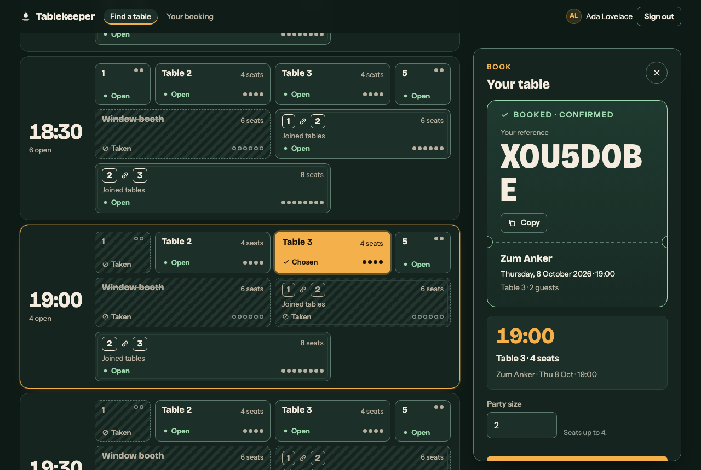

# Clausework — a dark factory that closes every spec clause with evidence

**Track:** tablekeeper · **Team:** Dhiraj Kavuri (solo) · **Event:** WeAreDevelopers x BAND Dark Factory

Five coding-agent seats in one BAND Desktop room built all four tablekeeper stages from
**one dispatched message**, in **74 minutes**, with no further human input. The factory's
unit of work is a specification clause: every sentence that says "must" becomes a numbered
clause, and a clause is closed only by evidence from a seat that did not write the code.

| | |
|---|---|
| Stages frozen | **4 of 4**, each claiming its own stage under judging conditions (fresh clone, isolated mode) |
| Human messages in the room | **1** (the dispatch). 0 steering, 0 approvals, 0 reruns, 0 restarts |
| Wall-clock | **74 min** dispatch to final report |
| Specification clauses registered | **240** (97 / 44 / 61 / 38) |
| Checks the band wrote from the spec, sealed by hash before inspection | **118**, all passing on the frozen stages |
| Planted-defect audit of those checks | band's checks caught **20 of 20**; the supplied checks caught **4 of 20** |
| Rejections that changed product code | **2**: one fixed by `builder` (stage 1), one fixed by `finisher` (stage 3) |
| Seats that authored product code | 2 (`builder` 11 commits, `finisher` 8) of 91 commits by 5 seats |
| Measured model use | 136.0 M tokens, 666 API calls, **$52.23** at list price (ran on one Claude subscription) |
| Same mandates, same hash, on a second problem | yes: the toy track, see [`portability/`](portability/) |
| Same factory, a second full run | yes: an earlier run also froze 4 of 4, see [Repeatability](#repeatability) |

Supplied checks on the frozen folders, isolated mode: stage 1 **120/120**, stage 2 **25/25**,
stage 3 **7/7**, stage 4 **6/6**. Those are a sample of the real suites (83%, 41%, 11%, 21%).
The numbers above are what the factory did about the part nobody ships.



## How to read this repository

| Path | What it is | Written by |
|---|---|---|
| [`FACTORY.md`](FACTORY.md) | The factory: seats, protocol, design choices and what they cost, failures, how to stand it up | human |
| [`mandates/`](mandates/) | One standing instruction file per seat. Nothing in them names this track | human |
| [`room.json`](room.json) | The BAND room, full download, unedited (2,056 events) | BAND |
| `stage-1/` … `stage-4/` | The service at each stage. Each folder builds and runs on its own (`RUN.md`) | band |
| [`evidence/ledger.md`](evidence/ledger.md) | The lead's running record: every order, verdict, ruling and freeze, with times | band |
| `evidence/stage-N/clauses.md` | The clause register for that stage | band (`examiner`) |
| `evidence/stage-N/seal.txt`, `probes/` | The hash committed before inspection, and the checks it sealed | band (`examiner`) |
| `evidence/stage-N/probe-audit.md` | Defects planted in scratch copies, and which checks caught them | band (`examiner`) |
| `evidence/stage-N/verdict-R.md` | The inspector's verdict for round R | band (`inspector`) |
| `evidence/stage-N/screens/`, `evidence/design/` | Screen captures at 375, 768 and 1280 px, and the design brief | band (`finisher`) |
| [`kit/`](kit/) | The dispatch exactly as sent, the seat-creation script, the harness wrapper, the usage report | human |
| [`portability/`](portability/) | The same mandates run on a different problem | band + BAND |

No human commit touches `stage-N/` or `evidence/`. Human commits are the mandates (before
the run) and `README.md`, `FACTORY.md`, `room.json`, `kit/`, `portability/` (after it).

## Live demo

https://clausework-vef3.onrender.com — stage 4 exactly as the band built it, on a free host, loaded with demo data on start ([`demo/`](demo/)). Sign in with `ada@example.com` / `correct horse`. The host sleeps when idle, so the first request can take up to a minute, and bookings reset on restart.

## Run it

```sh
cd stage-4
docker build -t tablekeeper-4 .
docker run --rm -p 8080:8080 -e PORT=8080 tablekeeper-4
# http://localhost:8080/
```

Node 22 with **zero dependencies**, state in memory, 25 backend modules (largest 271
lines), bundled Bricolage Grotesque and Instrument Sans with their licences, no runtime
network. Each stage folder has its own `RUN.md` and `DESIGN.md`.

## Check it

From a checkout of `band-ai/dark-factory-wearedevs`:

```sh
python -m harness check <this repo> --track tablekeeper
python -m harness run --track tablekeeper --repo <this repo> --all --mode isolated
```

## Repeatability

This is the second full run of the factory on tablekeeper. The first, three hours
earlier with the same mandates and a dispatch without the product brief, also froze four
of four stages from one message, in 85 minutes, in a different language (Python) and a
different look. It is public, unedited, at
[kinnuworks/clausework-tablekeeper](https://github.com/kinnuworks/clausework-tablekeeper).
We submit this run because its interface is better; `FACTORY.md` says what differed.
